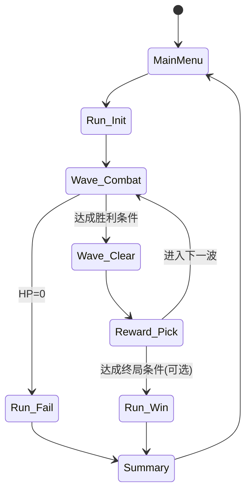

# TypeRogue 设计文档（Design Document）

版本：0.1  
最后更新：2026-02-21  
项目路径：`d:\unity_projects\TypeRogue`  
引擎：Unity（URP 2D + Input System + uGUI/UI Toolkit）  

---

## 1. 一句话概念（Elevator Pitch）

一款“打字即开火”的俯视防守Roguelike：敌人从上方向下涌来，玩家像炮塔一样守在底部。玩家通过输入单词触发武器与Buff组合，在每波结束后从三张卡中选择升级，逐步构建独特的输出流派，挑战更高波次与Boss。

---

## 2. 核心体验目标（Player Experience）

- 手感：输入与攻击反馈必须“零等待感”，让玩家把注意力放在节奏与决策上。
- 成长：每波必有明确变强点（新武器 / 武器升级 / 新Buff），Build逐渐成型。
- 压力：场面压力来自“屏幕空间+敌人推进”，而不是复杂的操作。
- 技能曲线：新手能靠基础武器存活并理解规则；高手通过输入效率与Build优化拉开差距。

---

## 3. 设计支柱（Pillars）

1. 打字即战斗：输入不是菜单操作，而是战斗动作本身。
2. Build可读：玩家一眼能理解当前武器、已激活Buff、下一次攻击的效果。
3. 选择有代价：每波三选一，放弃即意味着路线差异；“没有完美选项”才有rogue味道。
4. 快节奏短循环：单波 25–45 秒；选择 5–10 秒；持续“战斗→奖励→战斗”。

---

## 4. 目标平台与约束

- 平台：PC（键盘为主）
- 分辨率：16:9，推荐 1920×1080
- 输入法：默认英文键盘；允许为武器提供中文别名（可选项），确保中文玩家顺手

---

## 5. 核心循环（Core Loop）

### 5.1 单局循环

1. 进入波次
2. 敌人生成并向下推进
3. 玩家持续输入触发攻击与组合
4. 波次结束（敌人清空或计时结束）
5. 弹出三张卡（三选一）
6. 应用奖励，进入下一波

### 5.2 状态机（建议）



---

## 6. 输入系统（Typing System）

### 6.1 输入语法（玩家可理解的规则）

- 空格既是分隔符，也是“提交键”：玩家按下空格时会对当前词进行一次判定  
- 直接输入武器词并按空格：触发一次该武器攻击  
  - 示例：`pistol␠`
- 输入“Buff词 + 空格 + 武器词 + 空格”：为该武器激活一个 Buff，并立即触发一次攻击（见 6.4）  
  - 示例：`精准␠pistol␠`
- 允许武器/ Buff 有别名（可选）：  
  - `手枪` 可映射到 `pistol`  
  - `狙击` 可映射到 `sniper`

### 6.2 输入缓冲与判定

- 输入缓冲为一段字符串（可显示光标）
- 支持 Backspace 删除
- 支持 Space 分隔与提交（用于组合与触发）
- 判定策略：
  - 在玩家输入过程中实时做“前缀匹配”（用于提示与高亮）
  - 在玩家按下 Space（或 Enter）时，对“当前词”做一次“完整匹配”

按下 Space 时的判定顺序（建议）：
- 若当前词命中 Buff 词表：提交为 Buff 槽位（进入“等待武器词”状态）
- 否则若当前词命中武器词表：触发该武器（若存在已提交 Buff，则按组合规则执行）
- 否则：判定为错误（见 6.3）

### 6.3 错误处理（降低挫败感）

- 以“词”为粒度做纠错：玩家按下 Space 时，进行一次错误检定  
  - 若当前词不命中任何 Buff/武器：只清除该空格前的那个词，不清空全部输入历史  
  - 清除范围：从“上一个空格之后”到“当前光标之前”的字符
- 若处于“已提交 Buff、等待武器”的状态：  
  - 武器词错误时仅清除错误武器词，已提交的 Buff 保留，玩家可直接重打武器词并再次按空格提交
- 可选惩罚（用于高难度）：词错误时附加短暂输入冻结（例如 0.15–0.25s），但不应清空历史

### 6.4 “组合即攻击”规则（建议默认开启）

当玩家输入 `Buff 武器` 成功时：
- 先把 Buff 绑定到该武器（本波生效）
- 再立刻用该武器开火一次（避免组合输入变成纯菜单动作）

---

## 7. 战斗系统（Combat）

### 7.1 玩家（炮塔）

- 位置固定在底部中央（可轻微左右摆动表现目标锁定，不需要移动操作）
- 防线判定：敌人到达“玩家防线线”即造成伤害

### 7.2 目标选择（锁定逻辑）

默认规则（可调）：
- 武器攻击优先锁定“离防线最近”的敌人
- 若该武器为范围武器（shotgun/rocket），以该目标为中心做范围结算

替代规则（更有策略）：
- 支持输入“武器词 + 数字”锁定列（例如 `rifle 2`），但会提高复杂度；建议后续迭代再考虑

### 7.3 子弹与伤害结算

基础字段（用于平衡）：
- Damage（基础伤害）
- FireInterval（攻击间隔或连发子弹间隔）
- Projectiles（弹丸数量）
- Pattern（单发/连发/扇形/持续光束）
- Range / Speed（用于手感）
- Penetration（穿透数量）
- CritChance / CritMultiplier（暴击）

### 7.4 输出反馈优先级

- 输入正确：UI 高亮 + 轻音效
- 开火：枪口火焰/后坐力 + 音效
- 命中：敌人闪白/抖动 + 命中音
- 击杀：爆粒子 + 分数弹出
- 暴击：颜色区分 + 更大字号

---

## 8. 武器系统（Weapons）

### 8.1 基础武器（初始）

建议初始只给 2 把，降低信息量（推荐：pistol + shotgun）。

| 武器ID | 输入词(主) | 别名(可选) | 定位 |
|---|---|---|---|
| Pistol | pistol | 手枪 | 节奏武器，连发、稳定 |
| Shotgun | shotgun | 霰弹枪 | 应对贴脸群怪，范围清理 |

### 8.2 进阶武器（卡片解锁）

| 武器ID | 输入词 | 定位 | 关键参数倾向 |
|---|---|---|---|
| Rifle | rifle | 单点升级线 | 高伤害、少弹丸、可穿透 |
| SMG | smg | 手速回报 | 高射速、低单发、连发多 |
| Sniper | sniper | 精准爆发 | 极高伤害、低频、强穿透 |
| Rocket | rocket | 清屏工具 | 中频、范围爆炸、慢弹速 |
| Laser | laser | 持续输出 | 持续束、命中稳定、吃站位(敌人路线) |
| Grenade | grenade | 延迟爆破 | 抛物线/延时，适合预判 |

### 8.3 武器升级（卡片：某武器+某升级项）

升级项池（示例）：
- Damage +%
- FireRate +% 或 Interval -%
- Projectiles +1/+2
- SpreadAngle +%（霰弹类）
- Penetration +1
- ExplosionRadius +%
- Reload/Charge（若某武器有充能机制）

升级形态建议：每把武器有“主干升级（3–5级）+ 少量分支改造（1–2个）”，保证差异明显。

---

## 9. Buff 系统（Buffs）

### 9.1 Buff 获得与激活

- 获得：通过卡片“获得 Buff”
- 激活：本波内通过输入 `Buff 武器`
- 持续：默认只持续本波（强化rogue决策与输入节奏）
- 上限：每把武器最多 3 个激活 Buff

### 9.2 Buff 分类（便于平衡）

- 输出类：精准、狂暴、极速
- 控制类：冰冻
- 机制类：穿透、连锁、爆炸、燃烧、吸血

### 9.3 Buff 冲突与叠加

推荐规则：
- 同类“姿态类”互斥：狂暴 与 极速 互斥（避免乘算爆表）
- 机制类可并存：爆炸 + 连锁 + 穿透 允许组合
- 冲突处理：后激活覆盖前一个（并在 UI 给出覆盖提示）

### 9.4 组合特效（Build 亮点）

定义少量“命名组合”，做成玩家的目标：
- 精准 + 吸血：暴击吸血翻倍
- 狂暴 + 爆炸：爆炸半径 +50%
- 穿透 + 连锁：每次穿透后仍可弹射一次
- 极速 + 冰冻：减速持续时间 +X%

---

## 10. Rogue 卡片系统（Reward Cards）

### 10.1 卡片三选一结构

每波结束固定出现 3 张卡，从不同卡池抽取，保证多样性。

卡片类型：
- WeaponUpgrade：升级已拥有武器的某项
- GainBuff：获得一个 Buff（并可立即提示如何激活）
- UnlockWeapon：解锁新武器（加入右侧武器栏）
- Utility（可选后续）：回复生命、获得护盾、临时金币等

### 10.2 生成规则（建议）

- 先确定本次三张卡的“类型组合”（避免三张都同类）
  - 例：{WeaponUpgrade, GainBuff, UnlockWeapon} 概率最高
  - 波次早期降低 UnlockWeapon 出现率
- 再从对应卡池按权重抽取具体内容

### 10.3 稀有度（可选）

- Common / Rare / Epic
- 稀有度影响数值强度与机制复杂度

### 10.4 防止“死卡”

- 若玩家尚无任何可升级武器，则不生成 WeaponUpgrade
- 若 Buff 已全收集（或已满），则替换为其他类型
- 若玩家输入习惯偏弱（低准确率），提高“防御/回复类”出现权重（动态难度）

---

## 11. 敌人与波次（Enemies & Waves）

### 11.1 敌人基础原型

| 敌人ID | 特征 | 设计目的 |
|---|---|---|
| Grunt | 低血快 | 形成压迫、练输入节奏 |
| Brute | 高血慢 | 强迫玩家选择高伤或穿透 |
| Swarm | 成群低血 | 让 shotgun/爆炸价值凸显 |
| Flyer | 速度不稳定/路径偏移 | 打破“直线锁定”舒适区 |
| Tank | 极高血极慢 | 检验Build成型度 |

### 11.2 精英词缀（Elite Mods）

通过“敌人原型 + 词缀”组合制造变化：
- Split：死亡分裂
- Regen：缓慢回血
- Shield：先打掉护盾
- Summon：周期召唤
- Explode：死亡爆炸

### 11.3 Boss 设计（每 10 波）

Boss 目标：让玩家感到“Build在实战中被检验”，而不是单纯堆血。

建议 Boss 特征：
- 清晰的预警（风格化UI提示+轨迹线）
- 阶段切换（血量 70%/40%）
- 召唤小怪与本体技能交织（让范围武器也有用）

---

## 12. UI/UX 规范

### 12.1 三分区布局（与你的原案一致）

- 左侧 1/4：Buff 清单与“已激活（本波）”槽位
- 中间 1/2：主战场（玩家底部、敌人上方）
- 右侧 1/4：已解锁武器、输入词、当前武器状态
- 底部：输入框 + 提示信息 + 最近一次结算（伤害/暴击/击杀）

### 12.2 关键可读性要求

- 玩家必须在 0.2 秒内看懂“刚才输入是否成功”
- Buff 激活要有“绑定到哪把武器”的明确展示
- 组合覆盖要有提示（避免玩家以为叠加但实际覆盖）

---

## 13. 进度、难度与平衡指标

### 13.1 目标数值（用于调参）

- 新手目标：能稳定到第 8–12 波
- 熟练目标：能到第 20 波并形成明确流派
- 高手目标：能通关 40 波（或进入无尽高波）

输入指标（建议记录）：
- 准确率 Accuracy（%）
- 输入速度 WPM（或 CPM）
- 失败次数（错误输入/超时）

### 13.2 难度增长（建议）

采用“平滑增长 + 峰值波次”：
- 普通波：敌人数量 + 血量缓慢增长
- 事件波：短时间高密度生成，测试 AOE
- Boss 波：测试单点与生存

---

## 14. 数据驱动与内容制作规范（Unity）

### 14.1 ScriptableObject 资产类别（建议）

- WeaponData：武器参数、输入词、弹道模式、VFX/SFX引用
- BuffData：Buff 参数、输入词、冲突组、组合效果标记
- EnemyData：敌人参数、移动曲线、被击反馈
- WaveData：波次脚本（敌人组、时间轴、事件）
- CardData：卡片定义（类型、稀有度、效果引用、描述文本）

### 14.2 输入系统建议（Input System）

项目已包含 `com.unity.inputsystem` 与 `Assets/InputSystem_Actions.inputactions`：
- 建议建立一条“TextInput”通路，捕获字符输入
- 统一在一个 Input Router 中处理：
  - 输入缓冲
  - 前缀匹配提示
  - 完整匹配触发事件（FireWeapon / ActivateBuff）

---

## 15. 可测试用例（QA Checklist）

- 输入 `pistol␠`：触发开火
- 输入 `精准␠pistol␠`：Buff 绑定成功，且立即开火
- 输入 `精准␠pis␠`：判错后仅清除 `pis`，保留已提交的 `精准`
- 输入 `pis␠`：判错后仅清除 `pis`，不影响更早的输入历史展示
- 波次结束：暂停刷怪与伤害结算，弹出三卡；选择后正确应用并进入下一波
- Buff 覆盖：狂暴→极速，UI提示覆盖且最终只保留一个
- 武器升级：升级卡只会出现已拥有武器
- 高密度敌人：对象池无明显GC峰值

---

## 16. 迭代路线（建议）

MVP（先做“可玩且爽”）：
- 2 把武器（pistol/shotgun）
- 3 个 Buff（精准/狂暴/爆炸）
- 3 类敌人（小/中/大）
- 基础三卡系统（升级/新Buff/新武器）

扩展（做出rogue深度）：
- 精英词缀系统
- 命名组合特效
- Boss
- 成就解锁与输入统计面板

---

## 17. 系统实现文档（MVP-0：战场栏 + 下方玩家输入栏 + 仅手枪可用）

### 17.1 本轮实现范围（Scope）

本轮只交付“可运行的输入→判定→反馈”闭环，并把 UI 骨架搭好：

- 战场栏（Battle HUD Bar）：显示波次、玩家HP、当前武器、冷却、最近一次输入判定结果
- 下方玩家输入栏（Typing Input Bar）：显示输入缓冲（含光标）、提示语、最近一次判定（正确/错误）
- 仅手枪可用：识别输入词 `pistol` 与别名 `手枪`，按空格提交触发一次开火请求

非目标（明确不做）：

- Buff 实际生效、Buff 绑定槽位、组合规则
- 敌人生成、弹道、命中/击杀结算
- 波次状态机与奖励三选一

### 17.2 场景装配策略（手动搭建）

本项目从此轮开始采用“手动场景搭建 + Inspector 绑定引用”的方式，保证：

- 每个场景的 UI/层级可被完全控制（布局、样式、可视化迭代）
- 运行逻辑不做任何自动生成，便于排错与版本管理

因此本轮不再提供运行时自动装配入口，以下章节给出“必须存在的层级结构与引用绑定规范”。

### 17.3 必须的 GameObject 层级（场景中应存在）

```text
UI
  Canvas
    BattleHud
      WaveText
      HpText
      WeaponNameText
      WeaponCooldownText
      WeaponCooldownFill
      LastTypingText
    TypingInputBar
      BufferText
      HintText
      ResolveText
  EventSystem

GameRoot
  (挂组件：TypingInputRouter / TypingCommandInterpreter / PistolWeaponController / TypeRogueBootstrap)
```

### 17.4 UI 规格（战场栏 / 输入栏）

战场栏（BattleHud）：

- 位置：Canvas 顶部横条，height=80，左右拉伸
- 文本：
  - WaveText：左侧显示 `Wave {index}`
  - HpText：左侧显示 `HP {value}`
  - WeaponNameText：右侧显示武器名（当前固定 `Pistol`）
  - WeaponCooldownText：右侧显示 `READY` 或 `{剩余秒数}`
  - LastTypingText：中间显示 `OK: word` / `ERR: word`
- 冷却条：
  - WeaponCooldownFill：Filled Horizontal（0→1 表示冷却完成）

输入栏（TypingInputBar）：

- 位置：Canvas 底部横条，height=120，左右拉伸
- BufferText：显示输入缓冲（末尾闪烁 `|` 光标）
- HintText：显示可用输入提示（本轮为 `输入 pistol 或 手枪，按空格提交`）
- ResolveText：短暂显示“正确/错误”（自动隐藏）

### 17.5 输入与判定规则（对应设计文档 6.x 的子集）

已实现的规则：

- 捕获键盘字符输入，写入输入缓冲（支持 Backspace 删除）
- Space/Enter 作为提交键：提交“最后一个空格后的当前词”
- 完整匹配：
  - 命中 `pistol`/`手枪`：判定为武器词（成功），并立即触发一次开火请求
  - 否则：判定为错误词（失败）
- 错误处理（以词为粒度）：
  - 提交失败时仅清除“当前词”，保留更早输入历史（符合 6.3）

### 17.6 系统数据流（事件链路）

```mermaid
flowchart LR
  A[TypingInputRouter<br/>缓冲/提交] -->|WordSubmitted(word)| B[TypingCommandInterpreter<br/>词表匹配]
  B -->|Resolved(result)| C[UI: TypingInputBarView]
  B -->|Resolved(result)| D[UI: BattleHudView]
  B -->|PistolFireRequested| E[PistolWeaponController]
  A <-->|AppendCommittedSpace / RemoveCurrentWord| F[TypeRogueBootstrap<br/>协调器]
```

说明：

- [TypingInputRouter.cs](file:///d:/unity_projects/TypeRogue/Assets/Scripts/Typing/TypingInputRouter.cs) 负责输入缓冲与“提交事件”
- [TypingCommandInterpreter.cs](file:///d:/unity_projects/TypeRogue/Assets/Scripts/Typing/TypingCommandInterpreter.cs) 只做词表判定（本轮只含手枪词表）
- [TypeRogueBootstrap.cs](file:///d:/unity_projects/TypeRogue/Assets/Scripts/Bootstrap/TypeRogueBootstrap.cs) 负责：
  - 根据判定结果决定“追加提交空格 / 清除当前词”
  - 绑定 UI 更新、驱动武器冷却显示
- [PistolWeaponController.cs](file:///d:/unity_projects/TypeRogue/Assets/Scripts/Combat/PistolWeaponController.cs) 只实现最小冷却与开火事件（无弹道）

### 17.7 组件职责与对外接口（MVP-0）

TypingInputRouter

- 输出事件
  - `BufferChanged(string buffer)`
  - `WordSubmitted(string word)`
- 操作方法
  - `AppendCommittedSpace()`
  - `RemoveCurrentWord()`

TypingCommandInterpreter

- 初始化
  - `Initialize(IEnumerable<string> pistolAliases)`
- 提交
  - `SubmitWord(string word) -> TypingResolveResult`
- 输出事件
  - `Resolved(TypingResolveResult result)`
  - `PistolFireRequested()`

BattleHudView / TypingInputBarView

- 仅负责 UI 显示，不参与规则判定
- 允许通过 `Initialize(...)` 注入具体的 uGUI Text/Image 引用（支持运行时装配）

### 17.8 白盒测试与验收（本轮）

编辑器测试（已添加）：

- [TypingCommandInterpreterTests.cs](file:///d:/unity_projects/TypeRogue/Assets/Tests/EditMode/TypingCommandInterpreterTests.cs)
  - `pistol` 与 `手枪` 能被识别为手枪
  - 其他词返回 Unknown

手动验收（Play Mode）：

- 输入 `pistol` 后按空格：ResolveText 显示“正确”，BattleHud 显示 `OK: pistol`，输入缓冲在末尾追加一个空格
- 输入 `pis` 后按空格：ResolveText 显示“错误”，BattleHud 显示 `ERR: pis`，输入缓冲仅清除 `pis`
- 连续快速输入 `pistol␠pistol␠...`：WeaponCooldownText 应在冷却中显示倒计时，并在冷却完成显示 `READY`
